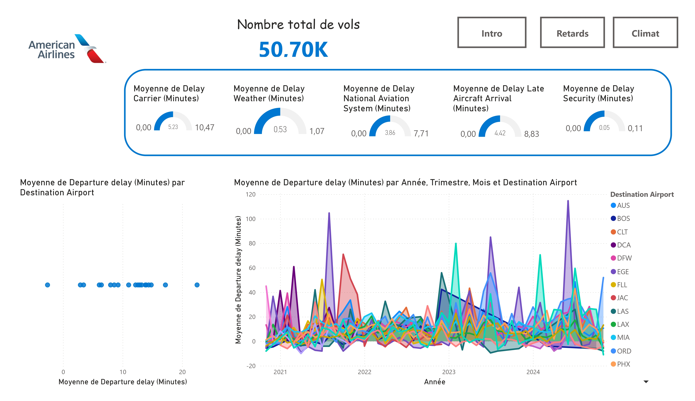
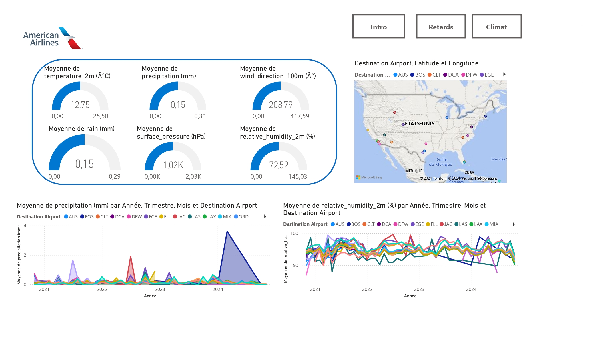

# Dashboard Power BI

## Description
Ce tableau de bord interactif a été conçu avec Power BI pour visualiser et analyser les données liées au projet de prédiction des retards de vols au départ de l'aéroport JFK.

### Fonctionnalités principales
- Analyse des tendances des retards en fonction des conditions météorologiques.
- Visualisations interactives pour explorer les données.
- Filtrage dynamique par période, type de vol, et autres paramètres.

### Aperçu

### Analyse 

**Analyse des conditions météorologiques**

Le premier tableau de bord met en évidence les principales variables climatiques susceptibles d’influencer les opérations de la compagnie American Airlines. On y trouve des indicateurs météorologiques présentés sous forme des cartes ,comme la température moyenne (12,75 °C), les précipitations moyennes (0,15 mm), l’humidité relative (72,52 %), la pression de surface et la direction moyenne du vent (208,79°). 
Ces données sont synthétisées sous forme de jauges, offrant une vue d’ensemble des conditions climatiques sur la période étudiée.
Ensuite, les graphiques en aires situés en bas montrent une évolution temporelle des précipitations et de l’humidité relative selon l’année, le trimestre, le mois et l’aéroport de destination .
Par exemple, on observe des pics de précipitations en 2024 pour certains aéroports, ce qui peut refléter des événements météorologiques spécifiques. Une carte interactive situe les aéroports de destination sur une carte des États-Unis, permettant de relier ces tendances climatiques à des régions spécifiques.

**Analyse des retards des vols**

Le second tableau de bord se concentre sur les retards de vols et leur décomposition en plusieurs catégories : retard dû au transporteur (5,23 minutes), à la météo (0,53 minute), au système national d’aviation, à l’arrivée tardive d’un avion précédent et à la sécurité. Ces moyennes permettent d’évaluer l’importance relative de chaque facteur sur les délais.
Les graphiques révèlent les tendances des retards de départ selon les années et les aéroports. Des pics de retard sont visibles en 2022 et 2023 pour certaines destinations comme Dallas-Fort Worth (DFW) ou Los Angeles (LAX). 
L’indicateur global indique que l’analyse repose sur un total de 50 700 vols, ce qui assure une représentativité des données.

Ces tableaux de bord peuvent être utilisés pour améliorer les performances opérationnelles d’American Airlines. Ils permettent de mieux anticiper les retards dus aux conditions météorologiques et de prendre des décisions informées. Par ailleurs, les données montrent que les retards causés par le transporteur et les arrivées tardives des avions constituent les principales causes de retard. En revanche, les retards dus aux conditions météorologiques sont relativement faibles et n’ont pas un impact significatif sur les retards globaux. Ces observations sont cohérentes avec les résultats obtenus dans la partie analyse descriptive et sont justifiées dans la section modélisation.

### Lien vers le tableau de bord
[🔗 Accéder au Dashboard Power BI](https://genes-my.sharepoint.com/:u:/g/personal/ooualy_ensae_fr/ESiOYZ4TogBIgNROU6ZsJoMBIZBKQedGTGrrDwHzvhcgbw?e=0RryVF)

---